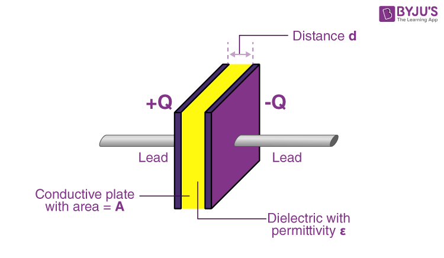
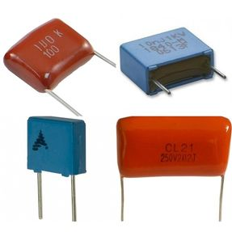
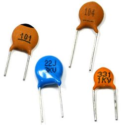
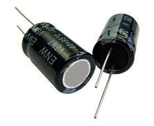

<!-- _class: lead -->
# Análise de Circuitos Elétricos
## Aula 05 - Capacitores e Indutores

Prof. M.Sc. Diego Ascânio Santos (ascanio@cefetmg.br)

CEFET-MG DIGDDV - Divinópolis, 2023.

---

## Roteiro

1. Elementos Passivos de Armazenamento de Energia
2. Capacitores
3. Indutores
4. Combinações de Capacitores e Indutores em Série e em Paralelo
5. Indutância Mútua
6. Lista de Exercícios

---

<!-- _class: lead -->
# Elementos Passivos de Armazenamento de Energia

---

## Elementos Passivos de Armazenamento de Energia

Elementos passivos de armazenamento de energia são elementos de circuitos elétricos que, não são capazes de fornecer energia por si próprios, mas, são capazes de armazenar energia na ocasião em que sejam submetidos a uma diferença de potencial.

São dois os elementos passivos que são capazes de armazenar energia em um circuito elétrico, sendo eles:

- [Capacitor](#05)
- [Indutor]()

---

## Capacitor

O capacitor é um componente elétrico que extrai energia de uma fonte (uma bateria por exemplo) e armazena (acumula) esta energia para libertá-la em um grande fluxo que esta fonte não seria capaz de prover. Isto ocorre porque os capacitores são capazes de acumular uma grande quantidade de carga elétrica.

---

## Capacitor

O disparo do flash de uma câmera analógica demanda um grande fluxo de energia que uma fonte convencional não é capaz de fornecer. O capacitor, por acumular cargas, é capaz de proporcionar este fluxo, ainda que em um curtíssimo espaço de tempo.

<figure>

<figcaption title="centered">
Capacitor em uma câmera fotográfica Cannon
</figcaption>
</figure>

---

## Capacitor

Os capacitores são amplamente utilizados em equipamentos eletrônicos e em aplicações computacionais para estabilizar tensões, filtrar sinais, acumular energia, dentre outros usos.

Apesar de armazenarem energia, não podem ser usados como baterias. Por que?

<!-- Porque os tempos em que liberam a energia armazenada são extremamente curtos, sendo incapazes de fornecer um fluxo de energia constante como o das baterias -->

---

## Capacitor

- Frequentemente, representamos capacitores como um conjunto constituído de duas placas metálicas paralelas de área \\(A\\) separadas por um material dielétrico <strong>(ISOLANTE)</strong> de largura \\(d\\) com constante de permissividade \\(\epsilon\\).

<!-- _class: transparent -->

---

## Capacitor

- Quando conectamos uma fonte de tensão contínua aos terminais de um capacitor, seu terminal ligado ao pólo positivo da fonte de tensão acumula cargas \\(q\\) positivas enquanto o terminal ligado ao pólo negativo acumula cargas negativas \\(-q\\). 

- Quando o capacitor atinge seu estado estacionário (final) ele está carregado e possui uma carga total \\(q\\) diretamente proporcional à tensão \\(V\\) aplicada em seus terminais.
    - \\(q \propto V\\)

- Esta proporcionalidade pode ser mapeada por um valor \\(C\\) conhecido como capacitância do capacitor, cuja unidade de medida é o farad \\((1 F = {{1 C} \over {1 V}})\\). Assim:
\\[ q = CV \\]

---

## Capacitor

- Pela equação da carga de um capacitor \\((q = CV)\\), verificamos que a capacitância é dada pela razão entre a carga que um capacitor armazena e a diferença de potencial aplicada a seus terminais: \\(C = {{q} \over {V}}\\).

- Entretanto, a capacitância (em capacitores paralelos) não depende de \\(q\\) ou \\(v\\), mas sim, das dimensões — área \\((A)\\) das placas e a distância \\((d)\\) entre elas — e propriedades físicas — \\((\epsilon) \rightarrow \\) constante de permissividade do material dielétrico entre as placas — do capacitor, onde:

\\[C = {{\epsilon A} \over {d}}\\]

<!-- _class: transparent -->

---

## Capacitor

Apesar da relação \\(C = {{\epsilon A} \over {d}}\\) ser válida apenas para capacitores de placas paralelas, a respeito da capacitância é possível concluir que três fatores chaves determinam seu valor, independente do tipo de capacitor abordado:

1. A área da superfície das placas;
2. O espaçamento entre as placas;
3. A permissividade do material dielétrico (isolante);

---

## Capacitor
### Representação em diagramas de circuitos e tipos de capacitores

Em diagramas de circuitos, os capcitores são tipicamente representados pela seguinte simbologia:

Normalmente, são comercializados capacitores que possuem capacitâncias que variam de picofarads \\((p F)\\) a microfarads \\((\mu F)\\) e os capacitores comercializados podem ser de poliéster:

Cerâmica:

Ou de elementos de propriedades eletrolíticas: <!-- formação de anodos e cátodos separados por uma camada de óxido isolante -->

---

<!-- _class: lead -->
# Relação Corrente-Tensão em um Capacitor

---

## Capacitor

"O símbolo gráfico do capacitor () nos faz lembrar que a capacitância ocorre sempre que condutores elétricos estiverem separados por um material dielétrico ou isolante. Essa condição significa que a carga elétrica não é conduzida através do capacitor." (NILSSON; RIEDEL, 2014).

"Embora a aplicação de uma tensão aos terminais do capacitor não o faça conduzir cargas através de seu dielétrico, ela pode produzir pequenos deslocamentos de uma carga dentro dele. À medida que a tensão varia com o tempo, esse deslocamento também varia com o tempo, provocando a conceitual <strong><a href="https://www.ufsm.br/cursos/graduacao/santa-maria/fisica/2020/02/27/o-que-e-a-corrente-de-deslocamento">corrente de deslocamento</a>"</strong> (NILSSON; RIEDEL, 2014).

---

## Capacitores

<article class="normal">

Em efeitos práticos, a corrente de deslocamento é indistinguível de uma corrente de condução e esta corrente é proporcional à taxa de variação no tempo da tensão aplicada ao capacitor ou, de forma matemática, a corrente do capacitor é dada por:

\\[
\begin{align}
i &\propto {{dV} \over {dt}} \rightarrow \\\\
i &= C {{dV} \over {dt}}
\end{align}
\\]

Onde \\({{dV} \over {dt}}\\) é a taxa de variação da tensão ao longo do tempo e \\(C\\) é a capacitância do capacitor.

</article>

---

## Capacitores

Observações decorrentes da equação da corrente no capacitor \\(i = {{C} {{dV} \over {dt}}}\\) :

1. Da equação da carga armazenada em um capacitor — \\(q = C V\\) — ao derivarmos os dois lados da equação em função do tempo, considerando que a capacitância é (também) uma constante de proporcionalidade, encontramos a mesma equação da corrente.

2. A tensão não pode variar instantaneamente nos terminais de um capacitor, ou seja, quando \\(dt \rightarrow 0\\), pois, tal variação produziria uma corrente infinita. Por isso, o capacitor não carrega instantaneamente.

3. Se a tensão nos terminais de um capacitor for constante — no estado estacionário, após a carga do capacitor — sua corrente é nula, pois, \\(dV = 0\\).
    1. Explicação física: o isolante do capacitor não permite que uma corrente de condução flua sobre si. A única corrente existente em um capacitor é a conceitual corrente de deslocamento, que existe até que o capacitor esteja totalmente carregado (cargas e descargas de capacitores / indutores serão abordadas nas próximas aulas).

Disto é possível concluir que, após carregado, o capacitor comporta-se como um circuto aberto na presença de uma tensão constante, pois, quando carregado, possui a mesma tensão da fonte que o carrega e a diferença de potencial do circuito, torna-se nula.

---

## Capacitor

Sabemos que a corrente em um capacitor é dada por \\( i = C {{dV} \over {dt}} \\). Se multiplicarmos ambos os lados da equação por \\(dt\\) e integrarmos os dois lados obtemos a tensão do capacitor:

\\[
\begin{align}
    i &= C {{dV} \over {dt}} \rightarrow \\\\
    i dt &= C dV \rightarrow  dV = {{1} \over {C}} i dt \\\\
    \int_{V(t_{0})}^{V(t)}{dV} &= {{1} \over {C}} \int_{t_{0}}^{t}{i dt} \rightarrow \\\\
    V(t) - V(t_{0}) &= {{1} \over {C}} \int_{t_{0}}^{t}{i dt} \rightarrow \\\\
    V(t) &= {\frac {1}{C}} \int_{t_{0}}^{t}{i dt} + V(t_{0})
\end{align}
\\]

---

## Capacitor
### Potência de um Capacitor

Sabendo que a equação geral da potência é:

\\[
p = vi
\\]

Podemos calcular a potência (fornecida ou consumida) do capacitor em função da tensão que ele armazena (ou fornece) ou em função de sua corrente de deslocamento (no tempo).

#### Em função da tensão
\\[
\begin{equation}
i = C \cdot {{dv} \over {dt}} \\\\
p = v \cdot i \\\\
p = v \cdot C \cdot {{dv} \over {dt}} \\\\
\end{equation}
\\]

#### Em função da corrente
##### (Considerando a tensão no tempo inicial \\(v(t_{0})\\))

\\[
\begin{equation}
    V(t) = {\frac {1}{C}} \int_{t_{0}}^{t}{i dt} + V(t_{0}) \\\\
    p = i \left[ {1 \over C} \int_{t_{0}}^{t}{i dt} + V(t_{0}) \right]
\end{equation}
\\]

---

## Capacitor

### Energia de um Capacitor

Sabendo que a potência de um capacitor é dada por:

\\[
{{dW} \over {dt}} = C v {{dv} \over {dt}}
\\]

Multiplicando-se os dois lados da equação por \\(dt\\) temos:

\\[
dW = C v dv
\\]

Considerando-se a quantidade final de energia como \\(W\\), a inicial como \\(0\\), a tensão final como \\(v\\), a tensão inicial como zero, \\(dW = dx\\) e \\(dv = dy\\), temos que:

\\[
\begin{equation}
\int_{0}^{W} dx = C \int_{0}^{v} y dy \\\\
W = 0.5 C v^{2}
\end{equation}
\\]

